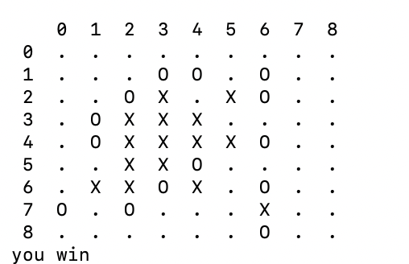

# Neural Gomoku

Pure neural-network Gomoku baseline inspired by Arthur Chiao's tic-tac-toe reinforcement learning example, but upgraded for a larger board:

- CNN policy-value network instead of a single-layer MLP
- neural MCTS self-play instead of training only against random moves
- legal-move masking, with no hand-written Gomoku strategy rules
- CLI for training and human-vs-model play

The first goal is not to beat strong engines immediately. It is to create a clean research repo where model capacity, self-play quality, and search can be improved without adding rule-based tactics.



## Setup

```bash
python3 -m venv .venv
source .venv/bin/activate
python -m pip install -r requirements.txt
python -m pip install -e . --no-build-isolation
```

If editable install fails because pip cannot reach PyPI, run commands with
`PYTHONPATH=src` from the repo root instead.

## Run Tests

```bash
python -m pytest
```

## Train

Start tiny to verify the loop:

```bash
python -m gomoku_agent.train --iterations 1 --games 5 --epochs 1 --board-size 9 --win-length 5 --mcts-sims 8
```

For normal Gomoku:

```bash
python -m gomoku_agent.train --iterations 3 --games 30 --epochs 2 --board-size 15 --win-length 5 --mcts-sims 16
```

Checkpoints are written to `checkpoints/latest.pt`. A checkpoint is tied to
its board size, so use separate files when switching between 9x9 and 15x15:

```bash
python -m gomoku_agent.train --board-size 9 --checkpoint checkpoints/9x9.pt
python -m gomoku_agent.play --board-size 9 --checkpoint checkpoints/9x9.pt
```

MCTS is expensive on CPU. Increase `--games`, `--iterations`, and `--mcts-sims`
gradually only after the quick command works.

Optional tactical examples can be mixed into each iteration alongside self-play:

```bash
python -m gomoku_agent.train --board-size 9 --win-length 5 --tactical-examples 500
```

These supervised policy-value examples cover immediate wins, immediate blocks,
open fours, double-threat prevention, diamond-to-cross fork prevention, and
diagonal two-step fork prevention. They are disabled by default.

## Colab GPU

For faster 9x9 experiments, enable a GPU runtime in Google Colab, clone the
repo, and keep checkpoints in Google Drive so runtime disconnects do not erase
the trained model:

```python
from google.colab import drive
drive.mount("/content/drive")
```

```bash
git clone https://github.com/jingyifan112/neural-gomoku.git
cd /content/neural-gomoku
pip install -r requirements.txt
mkdir -p /content/drive/MyDrive/gomoku_checkpoints
```

Example 9x9 Colab training run:

```bash
PYTHONPATH=src python -m gomoku_agent.train \
  --iterations 3 \
  --games 20 \
  --epochs 1 \
  --board-size 9 \
  --win-length 5 \
  --mcts-sims 16 \
  --allow-immediate-loss \
  --checkpoint /content/drive/MyDrive/gomoku_checkpoints/9x9.pt
```

`--allow-immediate-loss` disables the expensive terminal safety checks during
self-play training. Human play still uses the safety checks by default.

## Play

```bash
python -m gomoku_agent.play --checkpoint checkpoints/latest.pt --board-size 15 --win-length 5 --mcts-sims 128
```

Enter moves as `row col`, using zero-based coordinates.

By default, human play uses deterministic neural MCTS. Use `--mcts-sims 0` to
test the raw policy network without search. Add `--sample` only when you
intentionally want a more exploratory, weaker raw-policy opponent.

MCTS also filters moves that allow the opponent to win immediately using only
the game's terminal-state rule. This is search safety, not hand-written Gomoku
shape knowledge. Pass `--allow-immediate-loss` to disable that filter.

## Roadmap

1. Current baseline: policy-value CNN with self-play sampling.
2. Add neural MCTS guided only by policy/value outputs.
3. Add data augmentation with board symmetries.
4. Run model-vs-model evaluation between checkpoints.
5. Tune residual blocks, channels, temperature, and replay buffer size.

## Experiment Logs

- [2026-05-21 human test](run_logs/2026-05-21-human-test.md)
- [2026-05-22 Colab GPU run](run_logs/2026-05-22-colab-gpu.md)
