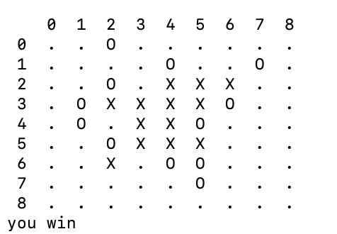

# 2026-05-21 Human Test

## Setup

- Board: 9x9
- Win length: 5
- Model: CNN policy-value network
- Search: neural MCTS with terminal safety checks

## Commands

```bash
PYTHONPATH=src python -m gomoku_agent.train --iterations 2 --games 10 --epochs 1 --board-size 9 --win-length 5 --mcts-sims 8 --checkpoint checkpoints/9x9.pt
PYTHONPATH=src python -m gomoku_agent.play --checkpoint checkpoints/9x9.pt --board-size 9 --win-length 5 --mcts-sims 64
```

## Notes

The current model is still beatable by a human player, but the MCTS safety layer prevents the most obvious one-move terminal blunders and blocks simple forced wins more reliably than the raw policy network.


